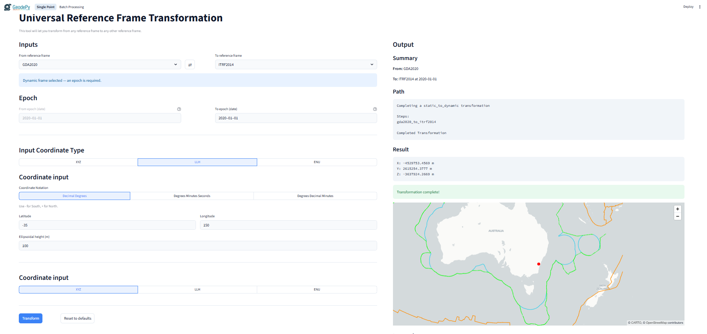

# URFT - Universal Reference Frame Transformer

## Overview
The **Universal Reference Frame Transformer** transforms coordinates between supported reference frames, including epoch handling for dynamic frames and optional uncertainty propagation. 

This repository also includes:
- A batch file module (`file_transformer.py`) used for processing csv data.
- A **Streamlit GUI** (`app.py`) for interactive single-point and batch transformations.

---

## Supported Reference Frames
Transformations can be completed between any of the following frames.

### Static

`GDA2020`, `GDA94`, `AGD66`, `AGD84`, `MGA94`, `MGA2020`

### Dynamic

**Australian:**

`ATRF2014`

**ITRF:**

`ITRF88`, `ITRF89`, `ITRF90`, `ITRF91`, `ITRF92`, `ITRF93`, `ITRF94`, `ITRF96`, `ITRF97`, `ITRF2000`, `ITRF2005`, `ITRF2008`, `ITRF2014`, `ITRF2020`

**WGS84:**

`WGS84 (Transit)`, `WGS84 (G730)`, `WGS84 (G873)`, `WGS84 (G1150)`, `WGS84 (G1674)`, `WGS84 (G1762)`, `WGS84 (G2139)`, `WGS84 (G2296)`, `WGS84 Ensemble`

---

## Dependencies
- GeodePy
- NumPy
- Shapely
- PyProj

For GUI:
- Streamlit
- pydeck

---

## Core Functionality
Transformation can take place in any of the three coordinate types. Depending on which coordinate type is input will decide which function should be used.

### XYZ (Cartesian)
```python
universal_transform(
    x, y, z,
    from_ref, to_ref,
    from_epoch=None, to_epoch=None,
    plate_motion="auto", vcv=None,
    return_type="xyz", ignore_errors=False,
)
```

### LLH (Latitude/Longitude/Height)
```python
universal_transform_llh(
    lat, lon, el_height,
    from_ref, to_ref,
    from_epoch=None, to_epoch=None,
    plate_motion="auto", vcv=None,
    return_type="llh", ignore_errors=False,
)
```

### ENU (Projected Easting/Northing/Height + Zone)
```python
universal_transform_enu(
    east, north, height, zone,
    from_ref, to_ref,
    from_epoch=None, to_epoch=None,
    plate_motion="auto", vcv=None,
    return_type="enu", ignore_errors=False,
)
```

**Key parameters**
- `plate_motion`: `"auto"` selects plate motion automatically; `"aus"` forces the Australian plate motion model.
- `vcv`: optional 3×3 NumPy array for uncertainty propagation.
- `return_type`: one of `"xyz"`, `"llh"`, `"enu"`.
- `ignore_errors`: When set to true will run transformation even if it shouldn't

---

## Epoch Requirements
Epoch inputs depend on whether the source/target frames are static or dynamic.

- **Static → Static:** no epochs required
- **Static → Dynamic:** `to_epoch` required
- **Dynamic → Static:** `from_epoch` required
- **Dynamic → Dynamic:** `from_epoch` and `to_epoch` required

---

## Output
Output can be in any of the three coordinate types. All functions return a dictionary containing:
- `type`: output coordinate type (`xyz`, `llh`, or `enu`)
- `vcv`: 3×3 NumPy array if uncertainties are available, else `None`
- `coords`: coordinate fields matching the output type

For example to access the coords from an llh coordinate type you would use to following

```python
latitude = result['coords']['lat']
longitude = results['coords']['lon']
```

---

## Streamlit GUI
A Streamlit app is provided in `app.py` with two pages:
- **Single Point**
- **Batch Processing**

To run:
```bash
streamlit run app.py
```



---

## Batch / File Transformation Helper
`file_transformer.py` let you complete batch processing of points in a csv. To do so it has two classes to handle required data:
- `TransformParams` holds transformation parameters that are not the coordinates
- `CSVCoordinateMapping` for mapping coordinate columns in csv (supports `xyz`, `llh`, and `enu`)

Using these classes a csv file can be transformed using the following function.

```python
csv_transformation(file_path, CSVCoordinateMapping, TransformParams)
```

